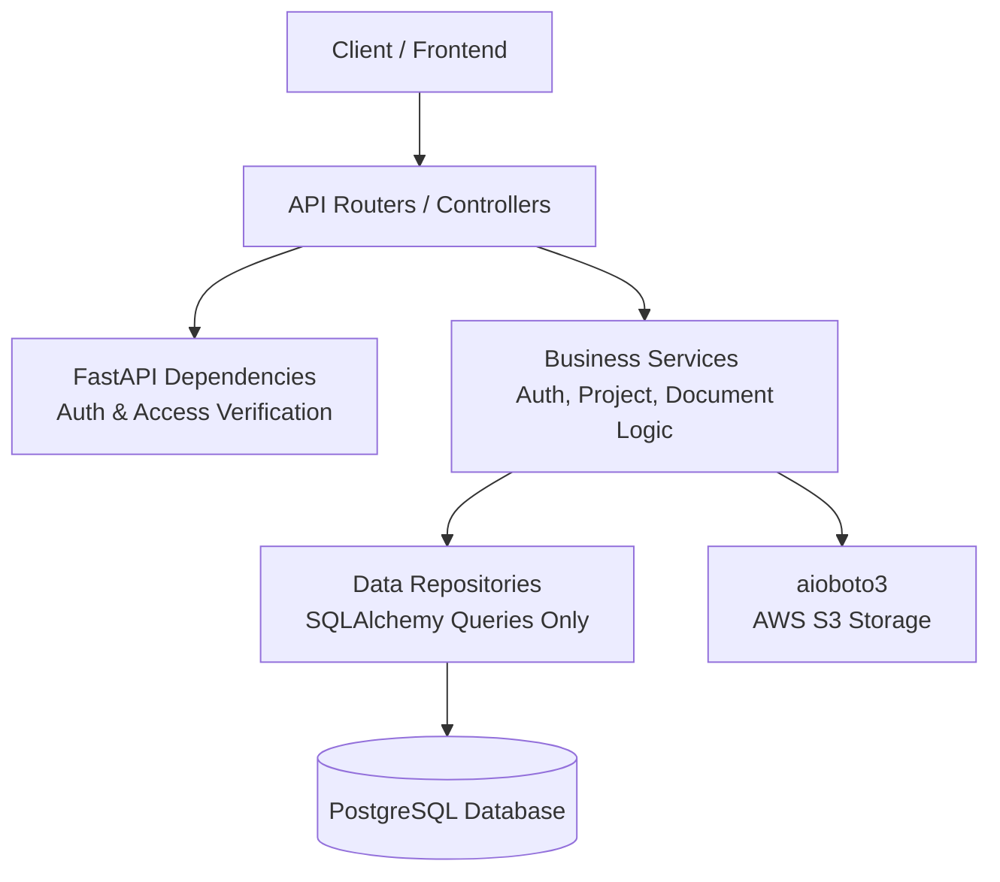
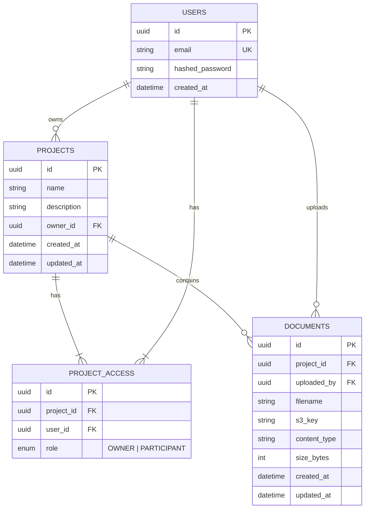

# Project Dashboard

[](https://www.python.org/)
[](https://fastapi.tiangolo.com/)
[](https://www.postgresql.org/)
[](https://www.docker.com/)
[](https://github.com/astral-sh/uv)

A production-ready, multi-tenant backend service designed for creating, managing, sharing, and securely storing project information. This service handles project metadata, participant-based collaborations, and document attachments (PDF/DOCX) stored on AWS S3 with strict multi-tenant access control and storage quotas.

Built with **FastAPI**, **PostgreSQL** (using asynchronous **SQLAlchemy 2.0**), and **JWT-based authentication** featuring owner/participant role-based access control (RBAC).

---

## 🚀 Key Features

*   **🔐 Secure Authentication**: Multi-tenant isolation with registration, JWT tokens (1-hour expiration), and secure `Argon2` password hashing.
*   **📂 Project Management**: Complete CRUD operations on projects, restricted by ownership and participation permissions.
*   **📎 Document Storage**: File upload, download (via secure S3 presigned URLs), replacement, and deletion with automatic AWS S3 sync.
*   **👥 Project Sharing**: Effortless collaboration invites via email. Invited users instantly receive `participant` privileges.
*   **💾 Enforced Storage Quotas**: Real-time project-level storage limits validated seamlessly before database commits.
*   **🛡️ Multi-Tenant Access Control**: Built-in FastAPI dependencies automatically handle role resolution, ensuring only owners can delete projects or manage invitations.

---

## 🛠️ Tech Stack

| Layer | Choice | Why? |
| :--- | :--- | :--- |
| **API Framework** | **FastAPI** | High performance, automatic OpenAPI documentation, asynchronous support. |
| **Database** | **PostgreSQL** + **SQLAlchemy 2.0** | Robust relational capabilities using modern async (`asyncpg`) paradigms. |
| **Migrations** | **Alembic** | Reliable, reproducible schema migrations. |
| **Auth** | **JWT** (`python-jose`) + **Argon2** (`argon2-cffi`) | Industry-standard password hashing and secure stateless token validation. |
| **File Storage** | **AWS S3** (`aioboto3`) | Scalable, secure, and asynchronous file storage operations. |
| **Validation** | **Pydantic v2** | Highly performant data parsing, serialization, and settings management. |
| **Testing** | **pytest** + **pytest-asyncio** + **httpx** | Async-first testing suites with isolated test database teardowns. |
| **Package Manager** | **uv** | Modern, blazingly fast Python package management and virtual environment tooling. |
| **CI** | **GitHub Actions** | Fully automated, lint and test |

---

## 📐 Architecture & Directory Layout

The codebase enforces a highly modular, decoupled layered architecture to ensure clean isolation of concerns and seamless testability.

```text
src/project_dashboard
	├── api/             # Routers, dependency injection, and HTTP exception handlers
	├── services/        # Business logic layers (AuthService, ProjectService, DocumentService)
	├── repositories/    # Data access layer (strictly containing SQLAlchemy queries)
	├── models/          # SQLAlchemy ORM declarative models
	├── schemas/         # Pydantic validation request/response schemas
	├── core/            # System configurations, interfaces, security tools, and global exceptions
	└── db/              # DB session lifecycle, base model definitions, and Alembic migrations
```

### Data Flow & Dependency Direction


> [!NOTE]
> **Dependency Inversion Principle**: Routers depend only on services (via FastAPI `Depends`), services depend only on repositories, and repositories are the exclusive layer interacting directly with the database. This design makes business logic fully testable independent of HTTP handlers or database states.

---

## 📊 Data Model

Our database uses a normalized relational model optimized for clean cascading deletions and flexible access roles:



*   **Cascading Deletes**: Handled directly at the database engine level. Deleting a project automatically and cleanly cascades to remove linked records in `project_access` and `documents`.

---

## 🛡️ Access Control & Authorization Matrix

Authorization is decoupled from the endpoint handlers and dynamically resolved per-request using FastAPI dependencies (`get_project_access`, `require_owner`).

| Action | API Endpoint | Owner | Participant |
| :--- | :--- | :---: | :---: |
| **Update Project Info** | `PUT /projects/{id}` | ✅ Yes | ❌ No |
| **Delete Project** | `DELETE /projects/{id}` | ✅ Yes | ❌ No |
| **Invite New Collaborator** | `POST /projects/{id}/invite` | ✅ Yes | ❌ No |
| **Upload Document** | `POST /projects/{id}/documents` | ✅ Yes | ✅ Yes |
| **Replace Document Content** | `PUT /documents/{id}` | ✅ Yes | ✅ Yes |
| **Edit Document Metadata** | `PATCH /documents/{id}` | ✅ Yes | ✅ Yes |
| **Delete Document** | `DELETE /documents/{id}` | ✅ Yes | ✅ Yes |
| **Download Document** | `GET /documents/{id}/download` | ✅ Yes | ✅ Yes |

---

## 🔌 API Reference

Full, interactive swagger documentation is available at `http://localhost:8000/docs` once the server is running.

### Authentication
| Method | Endpoint | Description | Auth Required |
| :--- | :--- | :--- | :---: |
| `POST` | `/auth/register` | Create a new tenant user account | No |
| `POST` | `/auth/login` | Authenticate user and retrieve JWT token | No |

### Projects
| Method | Endpoint | Description | Auth Required |
| :--- | :--- | :--- | :---: |
| `POST` | `/projects` | Create a new project (creator becomes `owner`) | Yes |
| `GET` | `/projects` | List all projects the user is authorized to see | Yes |
| `GET` | `/projects/{project_id}` | Retrieve specific details of a project | Yes |
| `PUT` | `/projects/{project_id}` | Update project metadata (name/description) | Yes (Owner) |
| `DELETE` | `/projects/{project_id}` | Delete a project and cascade-delete its files | Yes (Owner) |
| `POST` | `/projects/{project_id}/invite` | Invite a collaborator to a project as `participant` | Yes (Owner) |

### Documents
| Method | Endpoint | Description | Auth Required |
| :--- | :--- | :--- | :---: |
| `POST` | `/projects/{project_id}/documents` | Upload a document (enforces project storage limit) | Yes |
| `GET` | `/projects/{project_id}/documents` | List all documents inside a project | Yes |
| `GET` | `/documents/{document_id}/download` | Generate an AWS S3 secure, temporary presigned URL | Yes |
| `PATCH` | `/documents/{document_id}` | Update document metadata (e.g., filename) | Yes |
| `PUT` | `/documents/{document_id}` | Replace existing file content with a new upload | Yes |
| `DELETE` | `/documents/{document_id}` | Delete a document from S3 and the database | Yes |

> [!IMPORTANT]
> **API Design Choice (PUT vs PATCH for Documents)**:
> Rather than a generic update endpoint, this service uses precise REST conventions:
> *   `PATCH /documents/{id}` performs partial updates (such as changing file metadata or names).
> *   `PUT /documents/{id}` replaces the file content itself (triggers an S3 re-upload).

---

## ⚙️ Design Decisions & Tradeoffs

1.  **Synchronous Storage Quota Enforcement**:
    *   *Tradeoff*: Checking S3 folder sizes before file upload triggers an extra database `SUM()` query.
    *   *Decision*: This was chosen over asynchronous checking (such as S3 Events + Lambda functions) to completely close race conditions where a user could exceed their storage limit before an async check triggered.
2.  **Strict File Constraints**:
    *   Only `application/pdf` and `application/vnd.openxmlformats-officedocument.wordprocessingml.document` (DOCX) are accepted to keep S3 storage optimized and clean.

---

## 🏁 Getting Started

### Prerequisites

Ensure you have the following installed locally:
*   **Python 3.13+** (fully aligned with project specs in `pyproject.toml`)
*   **Docker & Docker Compose**
*   **[uv](https://docs.astral.sh/uv/)** (highly recommended Astral package manager)
*   **AWS S3 credentials** (or a local S3-compatible service / `moto` mock for test configurations)
---

### Setup Instructions

1.  **Clone the Repository & Set Environment Variables**
    ```bash
    git clone https://github.com/your-username/project-dashboard.git
    cd project-dashboard
    cp .env.example .env
    ```
    Open `.env` and fill in your connection variables (`POSTGRES_*`, `JWT_*`, `AWS_*`, and S3 variables).

2.  **Spin up Postgres & FastAPI with Docker Compose**
    ```bash
    docker compose up --build
    ```

3.  **Apply Database Migrations**
    In a new terminal window, run the migrations via `uv`:
    ```bash
    uv run alembic upgrade head
    ```

4.  **Explore API Interactive Docs**
    Open your browser and navigate to:
    *   Interactive Swagger UI: [http://localhost:8000/docs](http://localhost:8000/docs)
    *   ReDoc Alternative: [http://localhost:8000/redoc](http://localhost:8000/redoc)

---

### Running Locally Without Docker

If you prefer to run the environment natively, use `uv` for seamless dependency resolution:

```bash
# Sync dependency tree
uv sync

# Run database migrations
uv run alembic upgrade head

# Start local server with hot reloading
uv run uvicorn project_dashboard.main:app --reload
```

---

### Testing Suite

The test suite spins up and tears down an isolated dedicated test database (`{POSTGRES_DB}_test`) automatically for clean, isolated test runs.

Run tests:
```bash
uv run pytest
```

Run tests with test-coverage report:
```bash
uv run pytest --cov=project_dashboard
```

---

### Linting & Static Code Analysis

Ensure clean, PEP-8 compliant code and type checking before committing:

```bash
# Check styles and automatically fix lint issues
uv run ruff check .

# Perform static type checks
uv run mypy src
```

---

## 🌀 CI Pipeline

On every Push or Pull Request to the repository, a **GitHub Actions** workflow runs automatically:
1.  Sets up the build environment and installs dependencies using `uv`.
2.  Lints the codebase with `ruff`.
3.  Evaluates type systems with `mypy`.
4.  Spins up a temporary Postgres container service and runs the entire test suite.


---

## 🔑 Key Environment Variables Reference

See `.env.example` for the comprehensive list. The key system configurations are:

| Variable | Requirement | Description |
| :--- | :---: | :--- |
| `POSTGRES__USER` / `POSTGRES__PASSWORD` | Required | Master credentials for DB authentication |
| `POSTGRES__HOST` / `POSTGRES__PORT` | Required | Connection configuration endpoints |
| `JWT__SECRET_KEY` | Required | Cryptographic secret used to sign JWT tokens |
| `JWT__ALGORITHM` | Optional | Algorithm used for token signing (Default: `HS256`) |
| `AWS__ACCESS_KEY_ID` / `AWS__SECRET_ACCESS_KEY` | Required | AWS access credentials for S3 operations |
| `AWS__REGION` / `AWS__S3_BUCKET` | Required | Designated bucket details for storage |
| `DOCUMENT__MAX_PROJECT_STORAGE_BYTES` | Required | Hard threshold ceiling (bytes) for per-project S3 storage |
